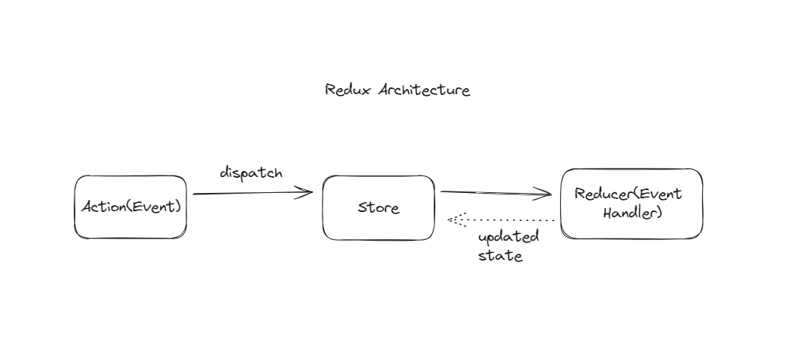

# This repository contains my learning progress on Redux.

## 1. Functinal Programming

It is a programming paradigm which is used to built software applications and solve real-world problems.
Some other programming paradigms are,

- Object-Oriented
- Event-Driven
- Procedural

Functions are `First class citizens ` of javascript. You can treat them like variables, parameters and etc.

```
function addNumbers(){
    console.log(2 + 2);
}

let fn = addNumbers();
```

### Higher-Order Functions

`Higher-order functions` are the functions which takes functions as parameters or returns them or doing both. Some examples are `Map(), Filter(), Reduce() and setTimeout()`.

#### Example

```
// Map function

let numbers = [1, 2, 3]
numbers.map((number) => {
    console.log(number*2)
})

// setTimeout function
setTimeout(addNumbers, 1000) // addNumbers() function from the previous section.
```

## Compose and Pipe

Compose and Pipe are the in-built functions from the library `Lodash` which helps to clean our code.

## Currying

`Currying` is the process of converting multiple parameters to a single parameter while passing it to a function.

```
// Traditional function
function add(a) {
  return function (b) {
    return a + b;
  };
}

const result = add(5)(4); //currying
console.log(result);
```

```
// Arrow function
const add1 = (a) => (b) => {
  return a + b;
};
console.log(add1(5)(5));
```

## Pure Functions

Pure functions are the functions which always gives same output for the same input.

## Immutablity

Immutablity is one of the properties of javascript. Immutability doesn't allow us change to the properties of an object. So in order to change the object, we need to copy the object and update it.

```
const person = {
  name: "John",
};
```

```
// Method 1 => using Object.assign()
const updated = Object.assign({}, person, { name: "Jane" });
console.log(person);
console.log(updated);
```

```

// Method 2 => using spread operator

const updated1 = { ...person, name: "jane", age: 22 };
console.log(person);
console.log(updated1);
```

Some libraries which are used to working with immutables are,

- Immutable
- Immer
- Mori

## 2.Redux Fundamentals

Three building blocks of redux are,

- Store: single representation of the object that maintains the state.
- Reducer: Event Handler.
- action(Event): pure javascript object defines what just happend.

### Redux architecture



- When the state of an object changes, the action creates an action object and ```dispatch``` it to the store.
- Then the store forward the action object towards the reducer and the reducer updates the state.
- After that, the store internally updates the new state.
- Finally refresh the UI components.

### Steps to Create Redux app
- Design the store
- Define the actions
- Create the reducers
- Set up the store
